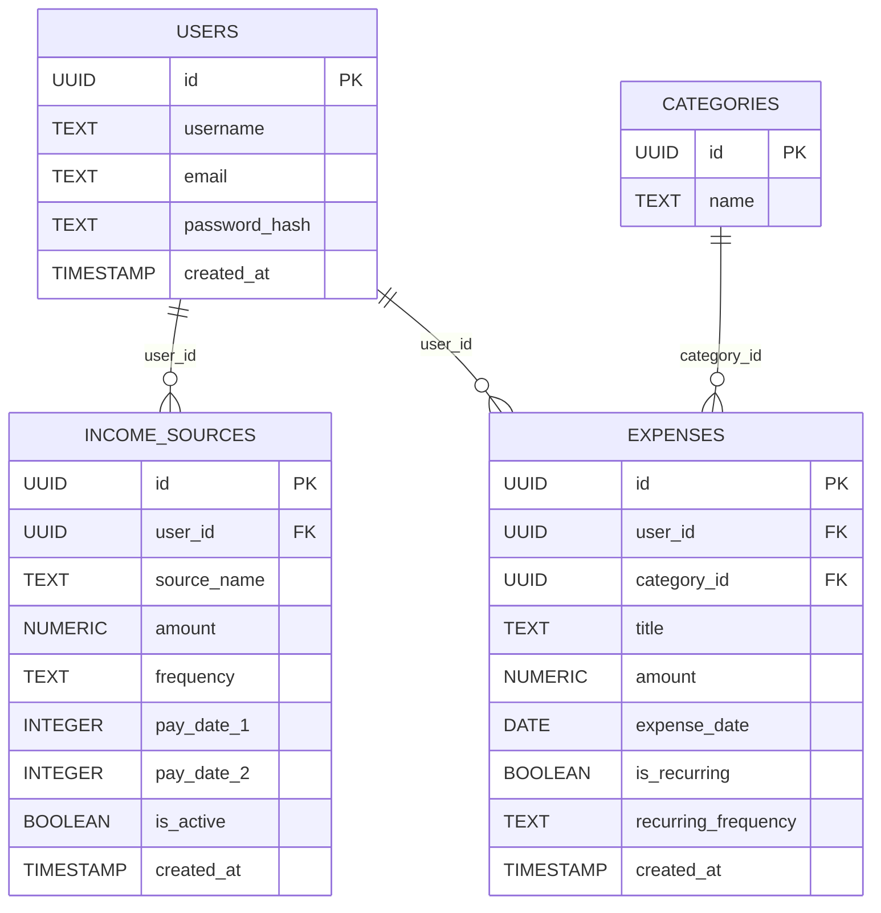
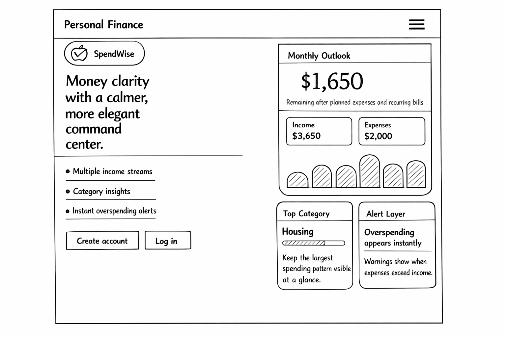

# SpendWise

## 🚀 30-Second Elevator Pitch

SpendWise is a modern personal finance web application that helps users understand their full money picture in one place. Built with the PERN stack, it allows users to manage multiple income sources, track expenses by category, and immediately see whether their spending is outpacing their income. With a clean dashboard, category-based insights, and overspending alerts, SpendWise turns budgeting into something visual, organized, and easier to act on.

---

## 🎯 Core MVP Features

These are the essential features included in the first working version of SpendWise:

### 👤 User Authentication

- User registration and login
- Protected routes for authenticated users
- Logout flow with transition screen

### 💵 Income Management

- Add multiple income sources
- Store income source name, amount, frequency, and optional pay dates
- Edit and delete income sources

### 🧾 Expense Tracking

- Add expenses with title, amount, category, date, and recurring status
- Edit and delete expenses
- Filter expenses by category

### 📊 Dashboard Overview

- View total income
- View total expenses
- View remaining balance
- Display an overspending alert when expenses exceed income

### 📈 Category Insights

- Visual expense breakdown by category
- Highest-spending category highlight
- Charts that color expenses from highest to lowest intensity

## 🌟 Stretch Goal Features

These features are planned to expand SpendWise beyond the MVP:

- Debt payoff planner using the snowball strategy
- Monthly category budget targets
- Recurring expense automation
- Downloadable or exportable monthly summary
- More advanced financial analytics and trends

## 🛠️ Tech Stack

- Frontend: React, React Router, Vite, Recharts
- Backend: Node.js, Express
- Database: PostgreSQL
- Authentication: JSON Web Tokens (JWT) with hashed passwords
- Local testing mode: Demo datastore for browser testing without Postgres setup

## 🗄️ Database Design

The current database schema for the MVP includes four main tables:



## 🔌 Possible API Endpoints

### 🔐 Auth

- `POST /api/auth/register` - Register a new user
- `POST /api/auth/login` - Authenticate user
- `GET /api/auth/me` - Get current authenticated user

### 🏷️ Categories

- `GET /api/categories` - Get all available expense categories

### 💵 Income

- `GET /api/income` - Get all income sources for a user
- `POST /api/income` - Create a new income source
- `PUT /api/income/:id` - Update an income source
- `DELETE /api/income/:id` - Delete an income source

### 🧾 Expenses

- `GET /api/expenses` - Get all expenses for a user
- `POST /api/expenses` - Create a new expense
- `PUT /api/expenses/:id` - Update an expense
- `DELETE /api/expenses/:id` - Delete an expense

### 📊 Dashboard

- `GET /api/dashboard/summary` - Get income, expense, and balance summary
- `GET /api/dashboard/category-insights` - Get expense totals grouped by category

## 🧩 Wireframes

*Initial wireframes for the application are included below:*

```
images/wireframes/
  ├── LandingPage.png
  ├── Dashboard.png
  ├── Expenses.png
  ├── Income.png
  ├── Insight
  └── Register.png
 
```